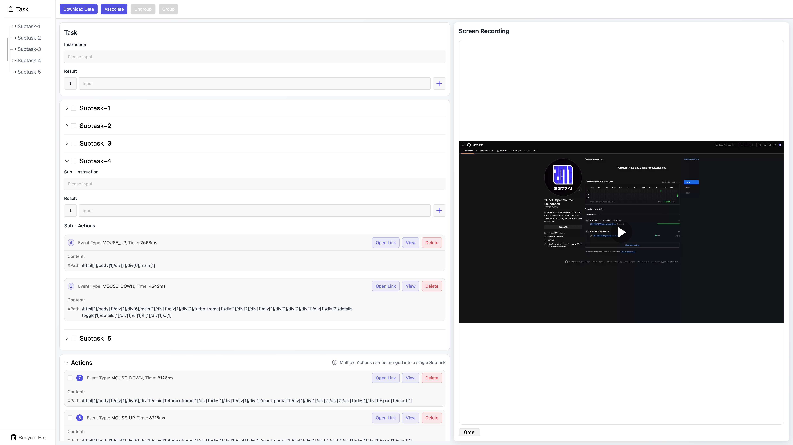

# Agentic Record Tool (ART)

[](LICENSE)
[](https://vuejs.org/)
[](https://www.typescriptlang.org/)
[](https://developer.chrome.com/docs/extensions/)

A Chrome extension for recording web interactions with synchronized video, featuring intelligent task grouping and workflow analysis.



## ✨ Features

- **📹 Record & Capture**: Synchronized video recording with all web interactions (clicks, inputs, navigation)
- **📋 Task Annotation**: Organize actions into subtasks with instructions and expected results
- **🔗 Workflow Mapping**: Visualize task dependencies through subtask associations
- **📦 Smart Export**: Download complete task data as structured JSON

## 📖 Documentation

- [User Guide](./docs/user_guide.md) - Complete step-by-step guide
- [Data Format Guide](./docs/data_format.md) - JSON export structure and usage
- [Commit Guidelines](./docs/commit_guidelines.md) - Git commit message conventions

## 🛠️ Tech Stack

- **Framework**: Vue 3 + TypeScript
- **Build Tool**: Vite 6
- **UI Library**: Naive UI
- **Storage**: Chrome Extension APIs
- **State Management**: Pinia

## 🚀 Quick Start

### Prerequisites

- Node.js 18+ and pnpm
- Google Chrome or Chromium-based browser

### Installation & Setup

1. **Clone and install dependencies:**

```bash
git clone https://github.com/2077AIDATA/AgenticRecordTool.git
cd AgenticRecordTool
pnpm install
```

2. **Start development server:**

```bash
pnpm run dev
```

3. **Build for Production:**

```bash
pnpm run build
```

4. **Load extension in Chrome:**

- Open Chrome and navigate to chrome://extensions/
- Enable "Developer mode"
- Click "Load unpacked" and select the dist directory

## 🏗️ Project Structure

```text
agentic-record-tool/
    ├── src/
    │   ├── background/          # Service worker for Chrome extension
    │   │   └── service-worker.ts
    │   ├── content/             # Content scripts injected into web pages
    │   │   └── content.ts
    │   ├── preview/             # Main preview and annotation interface
    │   │   ├── App.vue
    │   │   ├── components/
    │   │   │   ├── sidebar/     # Task sidebar, associations, recycle bin
    │   │   │   ├── task/        # Task sections, actions, subtasks
    │   │   │   └── video/       # Video player component
    │   │   ├── composables/
    │   │   │   ├── useActionManagement.ts
    │   │   │   ├── useAssociations.ts
    │   │   │   ├── useDataLoader.ts
    │   │   │   ├── usePersistence.ts
    │   │   │   ├── useTaskState.ts
    │   │   │   └── useVideoPlayer.ts
    │   │   └── types.ts
    │   ├── sidePanel/           # Extension popup UI
    │   │   ├── App.vue
    │   │   └── RecordActions.vue
    │   ├── offscreen/           # Offscreen document for screen recording
    │   │   └── App.vue
    │   ├── styles/
    │   ├── utils/
    │   │   └── i18n.ts
    │   └── types.ts
    ├── docs/
    │   ├── user_guide.md
    │   └── data_format.md
    ├── manifest.json
    ├── vite.config.ts
    ├── tsconfig.json
    └── package.json
```

## 🤝 Contributing

Contributions are welcome! Please read our Contributing Guide for details on our code of conduct and the process for submitting pull requests.

1. Fork the repository
2. Create your feature branch (git checkout -b feature/amazing-feature)
3. Commit your changes (git commit -m 'Add amazing feature')
4. Push to the branch (git push origin feature/amazing-feature)
5. Open a Pull Request

## 🐛 Reporting Issues

Found a bug or have a feature request? Please check our [issue tracker](https://github.com/2077AIDATA/AgenticRecordTool/issues) and search for existing issues before creating a new one.

## 📄 License

This project is licensed under the [MIT License](LICENSE).


## 📞 Support

- [Discussions](https://github.com/2077AIDATA/AgenticRecordTool/discussions)
- Check our [FAQ](https://github.com/2077AIDATA/AgenticRecordTool/wiki/FAQ) for common questions
- Email: [contact@2077ai.com](mailto:contact@2077ai.com)
